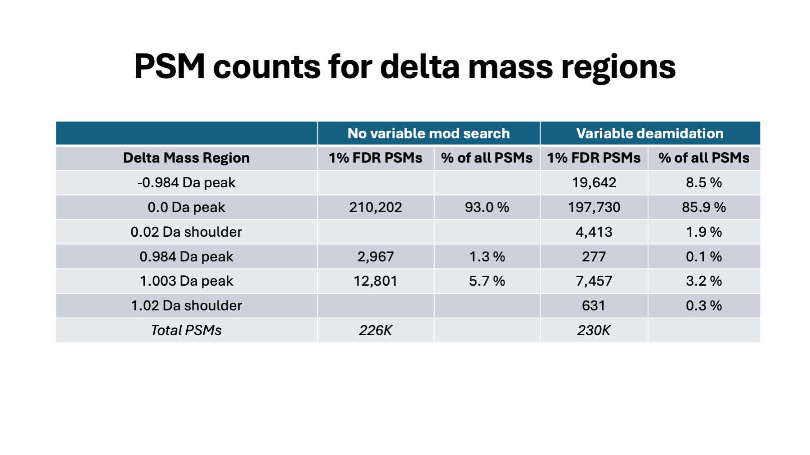

# detecting_deamidation

### Dr. Phillip Wilmarth
#### Senior Staff Scientist, PSR Core, Oregon Health & Science University
#### June 20, 2025

Deamidation is an easy post-translational modification to detect in tryptic digests, right? It is either a default or practically a default in most search engines, so it must be well tested and reliable, right? Keep reading and see just how good our tools are at this basic task after 30 years of refinement using instruments that can detect black holes and time travel.

---

## Presentation:

---

_Slide 1_

Deamidation (conversion of an amide to an acid) is a PTM with a mass shift of +0.984 Da that occurs on asparagine (N) and glutamine (Q) residues. See https://en.wikipedia.org/wiki/Deamidation and https://www.ionsource.com/Card/Deamidation/deamidation.htm. Deamidation can occur _in vivo_ in long lived proteins or be introduced _in vitro_ during sample processing.

---

_Slide 2_

Data is from Nick Riley Lab, UW exploring how digestion buffers affect in vitro deamidation rates. Publication: [Revisiting the Effect of Trypsin Digestion Buffers on Artificial Deamidation](https://pubs.acs.org/doi/pdf/10.1021/jasms.4c00389?casa_token=yn7K4EZBEtgAAAAA:MEqr257_bMqnXGIahtgRtbK5C39EjUDZJV5hmSoxJxAPNO3ckyw5Q0NenDIC_Su2CbNRtJllALXZIac).

[Preprint here](https://chemrxiv.org/engage/chemrxiv/article-details/66ecc4fc12ff75c3a1de91ea) and data here [PRIDE PXD04603](https://www.ebi.ac.uk/pride/archive/projects/PXD054603).

The analysis below is from the mouse cell runs described in the original preprint. The publication was exploring how much deamidation is caused by various buffers to determine which buffers are better if you do not want extra deamidation. My question was how reliable were the detected deamidated peptides in these bottom-up tryptic digests.

> Sutherland, E., Veth, T.S. and Riley, N.M., 2025. Revisiting the effect of trypsin digestion buffers on artificial deamidation. Journal of the American Society for Mass Spectrometry, 36(3), pp.457-462.

---

_Slide 3_

Data processing was with the Comet/PAW pipeline (https://github.com/pwilmart/PAW_pipeline). The pipeline incorporates an interactive, visual approach to target/decoy FDR control. Rather than adjusting coefficients in a classifier function, peptides are separated into distinct subclasses and simple target/decoy FDR applied to each subclass. Accurate masses from Orbitraps are part of the subclass process. Certain regions of delta mass (difference between measured and calculated peptide MH+ masses) histograms are used to create conditional score distributions. Score distributions are divided by peptide charge states (2+, 3+, and 4+), number of termini consistent with enzymatic cleavage, and by variable modifications (unmodified peptides and deamidated N, Q here).

A wide tolerance (1.25 Da precursor) search without any variable mods will have delta mass peaks at 0.984 Da and 1.003 Da from singly deamidated peptides and M1 errors in monoisotopic mass calls, respectively, in addition to a dominant 0.0 Da peak (the vast majority of the “correct” PSMs). The number of confident peptide identifications associated with the delta mass peaks could be determined. A second search with just variable deamidation of N and Q was performed and a similar analysis done. The number of PSMs associated with the delta mass peaks from both searches could be compared. The delta mass histogram peaks were also examined and compared.

---

_Slide 4_

The typical tryptic digest has most peptides in 2+ charge states (around 60%). 3+ peptides account for most of the rest of the identified peptides, with a small percentage of 4+ peptides. Larger numbers of higher charge state peptides usually indicates poorer tryptic digestion completion. This delta mass histogram is from all 14 runs and shows the 2+ peptides. The 0.0 Da peak is dominant. There is a weak doublet at 1 Da from deamidation (0.984 Da) and M1 monoisotopic peak errors (1.003 Da). There are no other visible blue (target matches) peaks above the red (decoy) background.

---

_Slide 5_

The delta mass peaks get wider with increasing peptide charge. These are the delta masses of the 3+ peptides from all 14 runs. The doublet at 1 Da has relatively more M1 matches compared to 2+ peptides. 3+ peptides tend to be larger and have relatively smaller monoisotopic peaks. It is more likely to have monoisotopic mass errors for larger peptides.

---

_Slide 6_

The 4+ peptides are much fewer, and the delta mass histograms can be noisier. 4+ peptides will be larger (on average) than 3+ peptides and M1 monoisotopic errors (the 1.003 peak) are even more pronounced (full range delta mass plot on top). There may be appreciable M2 peak monoisotopic peak errors for higher charge states like 4+ (maybe some 3+ also), but a wider precursor tolerance would have to be specified to see those delta mass peaks. Both the 3+ and 4+ delta mass histograms only have the 3 delta mass peaks because of the 1.25 Da choice. It should be mentioned that the odds of a peptide containing an N or Q also increases with increasing peptide length.

---

_Slide 7_

Here is the breakdown on what delta mass distributions usually look like for tryptic digests from analysis of hundreds of datasets over 2 decades. Simple searches have simple delta mass distributions like we have just seen. Mass calibration issues and instrument resolution can easily be checked by inspection of delta mass distributions. When the sample prep, instrument performance, and search settings are okay, the 0.0-Da delta mass peak will be dominant. The relative heights of the 0.984 and 1.003 delta mass peaks will vary depending on instrument, instrument settings, sample, and sample prep. At MS1 resolutions of 120K, the two peaks will be baseline resolved on Orbitraps (more so for 2+ peptides). The resolution increases with increasing peptide charge (at least for masses on the MH+ scale). The M1 peak increases in relative abundance with increasing peptide charge state. Delta mass distributions also show when monoisotopic mass correction algorithms over-correct and peaks at -1.003 Da appear.

---

_Slide 8_

We looked at the delta mass distributions from a Comet search with no variable mods. We want to detect deamidated peptides and one way to do that might be to allow variable deamidation modifications for N and Q residues. I am sure this would be the overwhelming consensus approach. What affect do we think a variable mod search will have on the delta mass distributions? If the 0.984 Da delta mass peak is from singly deamidated peptides, those matches should have a 0.0 Da delta mass with a deamidation modification mass added. The 0.984 peak should move to 0.0 Da and there should be an increase in the size of the 0.0 Da peak. Variable modifications increase search space size and increasing search space size affects search sensitivity at a given FDR. Sensitivity can go up or down depending on the types of PTMs specified and the proteins in the sample. It is not easy to predict which way this might play out. If incorrect and correct score distributions are well separated (because some appropriate meta score or classifier function was used), then changes in search space size have less effect on search sensitivity. This is a complicated topic, each dataset/sample is a little different, and generalizations should be avoided (they will often be wrong).

---

_Slide 9_

We see some expected things and some surprises for the 2+ peptide delta mass distribution in the search with variable mods. The 0.984 peak is gone (lower right expanded region) as we predicted. However, the 0.0 Da peak is smaller (142K versus 148K) compared to the search without variable mods. We have a new peak at -0.984 Da (and very weak peaks starting to show up at 0.02 Da and 1.02 Da).

---

_Slide 10_

The 3+ peptides have even more surprises. The -0.984 Da peak is relatively larger. We have also picked up small 0.019 Da higher delta mass peaks for the 0.0 Da peak and the 1.003 peak. There is a 19 milliDa difference (0.019 Da) in mass between deamidation and a neutron mass. The spacing of the three unexpected peaks (-0.984, 0.019, and 1.022) are all the mass of neutrons (1.003 Da) apart. This is the spacing of isotopic distribution peaks. We also have a decrease in the 0.0 Da peak (51.6K down from 57.2K) compared to the search without variable mods. This is clear evidence that M1 monoisotopic mis-assignments are being incorrectly interpreted as deamidated peptides. Note that what we know to be true from the accurate mass precursor measurements and what sequence scores best based on the MS2 spectrum are independent determinations (they do not have to agree).

---

_Slide 11_

The 4+ peptide data are sparser but show that the unexpected peaks are becoming relatively larger with increasing peptide charge state. The close mass shift from deamidation (0.984 Da) and isotopic peaks (1.003 Da), the isotopic peak spacing of the unexpected peaks, and their relative increase with charge state all suggest that these artifacts are related to isotopic peaks and not deamidation. The interesting observation is that they are highly biased towards target matches. Most search engines do not have any ways to match isotopic peaks of fragment ions. The instruments can isolate isotopically enriched peptide ion populations because of dynamic exclusion and monoisotopic mass errors. These effects may not be a large fraction of the data; however, many PTMs can be rather rare.

When deamidation of N and Q are allowed, the search engine has a limited way to shift fragment ion masses by nominally 1.0 Da. This may result in slightly better final search scores with modifications than unmodified peptides left with a precursor mass error. Real fragment ions have isotopic distributions and the presence of +1.003 Da fragment ion mass shifts are not random. Decoy databases (when properly constructed) model *random* errors and it not surprising that they might not model PTMs as accurately as whole peptide sequences. PTMs can be more like spectrum decorations rather than entirely new peptide matches, especially for deamidation.

---

_Slide 12_

Given the search parameters, there are only three delta mass peaks that can be associated with correct matches; namely, 0.0 Da, 0.984 Da, and 1.003 Da (for the 1.25 Da precursor window). In the search without any variable mods, there are 226K PSMs in these regions. When we allow variable deamidation, there are only 205.5K PSMs in these three regions. The total number of PSMs increases by about 4K when we allow variable deamidation. The number of “correct” PSMs drops by about 20K (226K down to 205.5K) in the three valid delta mass regions. The extra delta mass peaks that popped up in the variable deamidations search (-0.984 Da, 0.02 Da, and 1.02 Da) have about 24.7K PSMs. Calling PTMs “100% correct” or “100% wrong” is challenging. The matches in the 3 unexpected delta mass peaks might likely have the correct peptide sequence but have an incorrect deamidation PTM. Are they completely “wrong”? PTMs are more like partial credit in essay answers rather than binary True/False questions.

In this data, M1 isotopic peak effects are more abundant than true deamidations. Many of these peptides score better with variable deamidation even though they do not have any deamidated N or Q residues. Note that the PSMs for each delta mass region in the variable deamidation searches are a mix of unmodified and deamidated matches (the score distributions are separated in the PAW pipeline). The number of deamidated peptides in the variable deamidation search greatly exceeds the estimated extend of deamidation from the 0.984 Da region in the search with no variable modifications. There is no easy way to tell which of the deamidated matches are correct and which are “not correct” from the search engine information alone. Adding variable modifications for N and Q deamidation in typical search engines is not an acceptable way to identify deamidated peptides, even if the data was acquired with high mass accuracy/resolution (much higher resolution MS2 scans would need to be acquired). Detecting PTMs and localizing them to specific residues in bottom-up proteomics data is one of the hardest problems in the field. We have miles to go to solve this problem. This is a learning problem, not a “deep learning” problem. The fragment ion spectra results (the sequences matched to MS2 spectra) are not always accurate; some sort of specialized parsimony framework needs to be developed for PTMs.

---

_Slide 13_

Isotopically enriched precursor ions (M1 or M2 centered isolation windows) will have isotopically enriched fragment ions and larger b- and y-ions will have extra neutrons and have +1.003 Da mass shifts. These heavier fragment ions will have altered isotopic distributions and M1 peaks may become larger than M0 (monoisotopic) peaks. The noise filtering and spectrum processing of the MS2 spectrum might produce peak lists where larger fragment ions are mass shifted by 1 Da. Any unmodified peptides with mass shifted fragment ions that also contain N or Q residues might match fragment ions better with the nominal 1 Da mass shift that deamidation provides. Note that N and Q are common amino acid residues (maybe 60% of identified peptides will have an N or Q, and the odds go up for longer peptides [3+ and 4+]). These unmodified peptides are not really deamidated. They are artifacts of search engine scoring. They do not result in correct peptide masses, and they cause the satellite peaks at -0.984 Da, +0.019 Da, and +1.022 Da in the delta mass histograms.

---

_Slide 14_

In vitro deamidation will mostly happen after proteins are digested into peptides. 3D protein structures (generally) slow down deamidation rates. Tryptic peptides should behave like pentapeptides that have been used to determine primary deamidation rates as a function of all possible adjacent residues for both N and Q peptides (https://www.pnas.org/doi/full/10.1073/pnas.98.3.944). We know that primary deamidation rates for N-containing peptides are much greater than for Q-containing peptides, and that the rate for deamidation at NG motifs is by far the fastest.

> Robinson, N.E. and Robinson, A.B., 2001. Molecular clocks. Proceedings of the National Academy of Sciences, 98(3), pp.944-949.

If we are detecting accurate deamidated peptides that are induced in vitro by buffer choice, we would expect to see much more deamidation at N compared to Q. We should also see a large fraction of deamidation from NG motif peptides.

---

_Slide 15_

We have two competing methods for detecting “accurate” deamidated peptides with the Comet/PAW pipeline. We can start with a Comet search that has variable N, Q deamidation (no other mods to keep things simple), assume correct peptides (unmodified and deamidated) must have a 0.0 Da delta mass (ignoring 1.003 delta mass M1 monoisotopic mass errors), filter for the 0.0 Da delta mass region only, and further filter for 1% FDR based on conditional score distributions. In theory, all deamidated peptides detected with these criteria should be “correct”. We do not know to what extent we might have false positive deamidation assignments.

The alternative method is to start with a Comet search with no variable modifications and assume that all correct singly deamidated peptides must be in the 0.984 Da delta mass region. MS2 spectra associated with the 0.984 Da delta mass region are filtered out. A second Comet search is done on the filtered MS2 spectra with variable N, Q deamidation. Those results are further filtered for the 0.0 Da region only and then by 1% FDR for the conditional score distributions. The final filtered data should be a collection of very accurate singly deamidated peptides (and with deamidation sites determined). We do not know the overall sensitivity of this later method (my gut feeling is that it is okay but not 100%).

---

_Slide 16_

The data here is from all 14 runs combined. The last column seems unlikely given what we know about deamidation rates. We have an equal number of N and Q deamidations. We also have too few NG motif deamidated PSMs compared to the total. The delta mass method (center column) looks much more believable. There is 20 times more deamidation at N than Q, and deamidation at NG motifs is half of all deamidation (by spectral counting). The variable modifications method is very noisy (4.5 more total deamidated PSMs) even on a high mass accuracy instrument. The typical setting for characterizing tryptic peptides (even when using the Orbitrap for fragment ion masses) have serious problems distinguishing deamidation mass shifts from isotopic peak mass shifts. The data here is about as good you could possibly have for detecting deamidated peptides and the common method for identifying modified peptides fails miserably for deamidation. Deamidation is (clearly) a special case, but PTM work is extremely challenging and data analysis methods for PTM work are no where near as good as folks are led to believe.

---

_Slide 17_

MS2 spectra are (almost always) acquired at resolutions that cannot resolve deamidated masses and isotopic peak masses. Even if much higher resolution MS2 spectra were acquired, searche engines are not designed to do anything with the information. The similar delta masses (0.984 and 1.003 Da) make scrambling of deamidation mass shifts and isotopic peaks inevitable. Fragment ion spectra are heavily processed by search engines before scoring. The processing and noise filtering may make distinguishing deamidation and isotopic peaks from MS2 spectra even more difficult. Adding 1-Da mass shifts to theoretical fragment ion masses may result in better match scores even if there are no deamidated residues. Delta mass distributions provide an orthogonal way to uncover PTM mass shifts. Survey scans on Orbitraps have mass accuracy/resolution capable of resolving deamidated mass shifts from isotopic peak spacings. The PAW pipeline is flexible enough to filter out the likely deamidated peptides from unmodified searches so that variable deamidation searching can be constrained to only the spectra likely to have deamidated residues. This greatly enhances the accuracy of detecting deamidated peptides.

Deamidation and isotopic peak masses are so similar that deamidation as a variable PTM is probably a special case. However, all peptides and fragment ions have isotopic distributions which cause (nominal mass) +1 and +2 mass measurement ambiguities. There are often many PTMs that have masses within 1 or 2 Da of any PTM you may be interested in. The real issue is that peptide (and fragment) ions in mass spectrometers do not have a single m/z peak to measure. Peptides and mass shifts caused by adding PTMs (which have their own isotopic distributions) are really cases of a set of m/z peaks being shifted by something that also has a set of peaks. That makes determining the masses of unmodified peptides and the masses of their modified counterparts so that an accurate delta mass associated with the PTM a much harder problem. Adequately framing this problem has not been done well and you can’t solve problems that you can’t clearly define.   

---

_Slide 18_

We have the data quality and experience to do better. If you think I am being harsh on search engine developers, then how come no search engine warns users that detecting PTMs is much harder than it sounds (https://pwilmart.github.io/blog/2020/07/03/Open-search). Error rates for PTMs are probably not being properly controlled. PTM site localization is very hit and miss and not worth much. Narrow tolerance searches (https://pwilmart.github.io/blog/2021/04/22/Parent-ion-tolerance) seem to ignore reality and isotopic peak error options seem like a cobbled-on solution. All search engines heavily process the acquired ms2 spectrum and you might not recognize what is used to computer search engine match scores. This processing has implications for PTMs. At this stage of the game (30 years in), the search engine tool makers need to organize a retreat to define how to identify unmodified and modified peptides given the data we currently generate. It is time to drop last century’s algorithmic details of processing LCQ 3-D ion trap data or Q-Star TOF data and move our tools into the 21st century.

---
